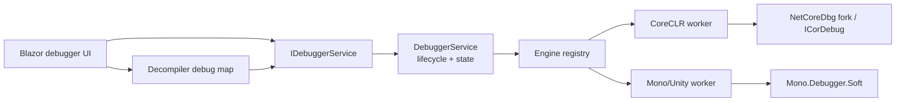
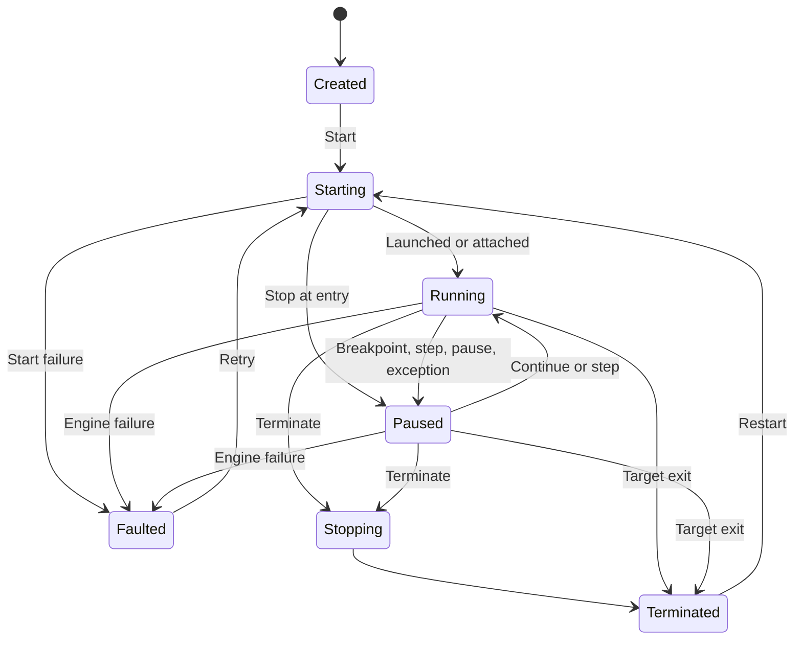

# Cross-platform debugger architecture

> Status: architecture, shared lifecycle, decompiled C# sequence maps, correlated DAP connection,
> worker supervision, stock NetCoreDbg CoreCLR engine, IL-breakpoint client protocol, source
> gutter, first debugger UI slice, and pinned stock-NetCoreDbg packaging are implemented. Native
> NetCoreDbg IL binding, Mono/Unity engines, persistence, and full debugger UI remain.

## Goals

The debugger will support:

- launching and attaching to CoreCLR applications on Windows x64 and Linux x64;
- attaching to Mono processes on Windows and Linux;
- attaching to Unity Editor and development players that use the Mono scripting backend;
- breakpoints in decompiled C# and IL, including assemblies without source or PDB files;
- continue, pause, step into/over/out, threads, stack frames, locals, arguments, watches,
  exception settings, and debugger output;
- optional PDB and Source Link projection when real source is available;
- one UI and application contract across all runtime engines.

IL2CPP, native debugging, mixed managed/native debugging, dump debugging, time-travel debugging,
hot reload, and .NET Framework desktop CLR debugging are not first-release goals. Unity IL2CPP is
native code and cannot be supported by the Mono soft-debugger engine.

## Core decision

Runtime adapters must expose runtime code identity, not source identity.

```text
(module MVID, method metadata token, IL offset)
```

This is the canonical identity for breakpoint placement and stopped locations. A decompiled text
span or PDB source line maps to this identity. It is never the durable identity itself.

Stock Debug Adapter Protocol source breakpoints are insufficient for a dnSpy-style debugger:
decompiled text is synthetic and often has no matching source file or PDB. Method-entry
breakpoints alone also cannot represent a breakpoint on an arbitrary decompiled statement.

## Component boundaries



`DnSpyXDX.Application` owns immutable UI-facing models and `IDebuggerService`.
`DnSpyXDX.Debugging` owns lifecycle policy and runtime-engine abstractions. Runtime-specific
projects will be added behind `IDebuggerEngineProvider`:

```text
src/
  DnSpyXDX.Application/
  DnSpyXDX.Debugging/
  DnSpyXDX.Debugging.Protocol/
  DnSpyXDX.Debugging.CoreClr/
  DnSpyXDX.Debugging.Mono/
  DnSpyXDX.Debugger.Worker/
```

The initial implementation keeps protocol and engine interfaces in `DnSpyXDX.Debugging`.
Projects split when the first worker is added, avoiding empty architecture-only assemblies now.

## Process model

Each debug session gets one worker process. Photino and the Blazor UI never load `dbgshim`,
`mscordbi`, Mono debugger libraries, or target-specific runtime components.

Benefits:

- a native debugger crash does not destroy the assembly-browser session;
- CoreCLR and Mono dependency graphs cannot conflict inside the UI process;
- worker architecture and runtime files can be selected for the target;
- termination has a hard process boundary;
- debugger protocol traffic can be recorded and replayed in tests.

The host-to-worker protocol uses DAP framing over anonymous pipes or redirected standard I/O:

```text
Content-Length: <UTF-8 byte count>\r\n
\r\n
<JSON payload>
```

Standard DAP requests cover lifecycle, threads, stack traces, scopes, variables, evaluation, and
output. DnSpyXDX extensions use an `xdx/` prefix:

- `xdx/setIlBreakpoints`
- `xdx/modules`
- `xdx/resolveRuntimeLocation`
- `xdx/getMethodBody`

Every request includes a session generation. Events from a previous worker generation are
discarded after termination or restart.

`DapConnection` owns one input read loop, correlates responses by `request_seq`, serializes
concurrent writes, dispatches events, and answers adapter-initiated reverse requests. Local request
cancellation removes correlation state without stopping the connection; a late adapter response
is ignored. Protocol failure faults every pending request.

`DebuggerWorker` starts an adapter without shell command-line parsing, redirects all standard
streams, forwards standard error as debugger output, and reports expected versus unexpected exit.
Shutdown sends `disconnect`, closes adapter input, waits for a bounded grace period, then kills the
entire adapter process tree. Tests use a real child process for normal exit, crash, and hang cases.

## CoreCLR engine

Use a pinned, reproducible fork of
[NetCoreDbg](https://github.com/Samsung/netcoredbg), built for `win-x64` and `linux-x64`.
NetCoreDbg is MIT-licensed, supports DAP, and already owns the difficult ICorDebug callback and
runtime-loading machinery.

The current stock adapter provider supports:

- executable discovery from explicit configuration, `DNSPYXDX_NETCOREDBG_PATH`, packaged
  RID-specific directories, or `PATH`;
- launch of managed `.dll` files and executables;
- local process attach;
- initialize/launch-or-attach/configurationDone handshake;
- continue, pause, step into/over/out;
- threads, PDB-backed stack frames, scopes, variables, and evaluation;
- stopped, continued, output, process, exit, termination, protocol-fault, and worker-fault events;
- capability projection without claiming decompiled-code breakpoint support.

The provider is registered in the desktop host even when NetCoreDbg is absent. Host build/publish
downloads pinned `3.2.0-1092` payload for `win-x64` or `linux-x64`, verifies SHA-256, caches it
under `obj`, and copies it into the provider's RID-specific discovery path. NetCoreDbg binaries
are never downloaded at application runtime. Bundling can be disabled for offline or externally
packaged builds.

The fork adds IL breakpoint commands backed by `ICorDebugFunction`,
`ICorDebugCode`, and `ICorDebugFunctionBreakpoint`. It must:

1. locate a loaded module by MVID;
2. resolve the method definition token inside that module;
3. select IL code, not native/JIT address identity;
4. validate and bind the requested IL offset;
5. report pending breakpoints until the module loads;
6. rebind after module unload/reload or Edit and Continue changes;
7. return actual bound IL offsets to the UI.

Microsoft's `dbgshim` API loads a runtime-matching `ICorDebug` implementation. Runtime-specific
`mscordbi` and DAC versions must match the debuggee. The adapter must never assume the debugger
application's .NET runtime matches the target runtime.

The stock CoreCLR milestone is implemented and was live-smoke-tested on Windows x64 against
official NetCoreDbg `3.2.0-1092` and a .NET 10 target for launch, stop-at-entry, attach, pause,
threads, stack frames, and termination. Conditional integration tests run whenever
`DNSPYXDX_NETCOREDBG_PATH` is set. Stock adapters keep
`SupportsDecompiledCodeBreakpoints` false and receive no custom request. An extended adapter must
advertise `supportsXdxIlBreakpoints`; the client then sends the complete IL-breakpoint set through
`xdx/setIlBreakpoints`, validates one binding per UUID, and reads `xdxLocation` from stopped events
and stack frames. Initial breakpoints bind before `configurationDone`. The contract and test
adapter are implemented; native ICorDebug binding in a pinned NetCoreDbg fork remains. See
[NetCoreDbg IL-breakpoint extension](netcoredbg-il-breakpoint-protocol.md).

## Mono and Unity engine

Use Mono's soft-debugger protocol through `Mono.Debugger.Soft`. The engine connects to a Mono
debugger agent over TCP and translates `MethodMirror` locations into MVID, metadata token, and IL
offset.

Two connection modes are needed:

- direct Mono: user supplies host and port, or DnSpyXDX launches a process with debugger-agent
  options;
- Unity Mono: discover Unity Editor/development-player endpoints, then attach through the
  Unity-compatible soft-debugger client.

Unity uses a fork of Mono, so protocol-version negotiation and capability detection are mandatory.
The engine must tolerate older Unity protocol versions and disable unsupported operations instead
of assuming current upstream Mono behavior.

Security defaults:

- direct attach defaults to loopback;
- remote hosts require explicit user action;
- no automatic connection to an untrusted broadcast result;
- show target host, port, Unity project/player name, and process identity before attach;
- never expose a listener on all interfaces by default.

## Decompiled source mapping

`ICSharpCode.Decompiler` already produces synthetic sequence points for decompiled syntax trees.
The next decompilation contract adds an immutable map:

```csharp
public sealed record DebugDocumentMap(
    SymbolId Document,
    IReadOnlyList<DebugDocumentSequencePoint> SequencePoints);

public sealed record DebugDocumentSequencePoint(
    int StartOffset,
    int Length,
    DebugCodeLocation Location,
    int EndILOffset);
```

Mapping rules:

1. User clicks a decompiled C# statement.
2. Viewer selects the smallest non-hidden sequence point containing that document offset.
3. Breakpoint store records its `DebugCodeLocation`.
4. Engine returns pending, verified, moved, or rejected binding.
5. Current-instruction highlighting maps stopped IL offset back to the closest containing point.
6. If optimized code has no exact point, UI shows the actual bound location and explains the move.

Maps are keyed by decompiler settings that affect layout. They are invalidated with the
decompiled document cache. Token-comment insertion and namespace wrapping must adjust document
offsets before publishing a map.

PDB sequence points use the same runtime location and may project to a real source document. A
source checksum is verified before showing a local file. Source Link downloads require explicit
network policy and a bounded cache.

## Session model

Lifecycle:



Commands are serialized. Engine events may arrive on any thread, so snapshots are immutable and
updated under a short lock. No UI callback runs while that lock is held. Queries requiring frame
or variable handles are legal only while paused; handles become invalid on continue.

Breakpoints survive a run/restart at workspace level, but engine bindings are session-local.
Pending bindings are expected when their module has not loaded.

## UI integration

Debugger UI adds:

- Run menu and launch/attach configuration;
- toolbar for continue, pause, stop, restart, and step commands;
- breakpoint gutter in C# and IL views;
- threads/call-stack panel;
- locals, arguments, autos, watches, and evaluation panel;
- breakpoints panel with enabled, pending, moved, and error states;
- modules and debugger-output panels;
- current statement and exception markers.

UI consumes immutable snapshots. It must not retain engine frame or variable references after
session resumes.

The first UI slice now includes:

- CoreCLR launch/attach dialog and execution toolbar;
- C#/IL breakpoint gutter backed by decompiler sequence maps;
- current-statement gutter marker;
- call stack, locals, breakpoint status, and bounded debugger-output panels;
- automatic frame/locals refresh on pause and handle invalidation on resume.

Watches, exception settings, modules, restart, breakpoint persistence, tree variables, and source
navigation from stack frames remain.

## Reliability and test matrix

Unit tests:

- lifecycle transitions and invalid commands;
- stale generation/event rejection;
- breakpoint persistence and binding updates;
- DAP framing with partial reads, multiple messages, malformed headers, size limits, and
  cancellation;
- module MVID/token/IL-offset mapping;
- decompiled document offset mapping.

Integration tests:

- launch and attach small CoreCLR targets;
- pending breakpoint binds after assembly load;
- breakpoint in assembly without PDB;
- step, exception, locals, evaluation, unload, and target exit;
- Mono debugger-agent attach;
- representative Unity LTS Editor and development-player attach;
- worker crash and forced termination recovery.

Release matrix:

- Windows x64 host and target;
- Linux x64 host and target;
- cross-version CoreCLR targets supported by the pinned NetCoreDbg build;
- Unity Mono versions selected from supported LTS lines.

## Delivery order

1. **Complete:** shared models, engine registry, strict session lifecycle, IL-native breakpoint
   identity, and unit tests.
2. **Complete:** decompiler document-to-IL sequence maps and breakpoint gutter.
3. **Complete:** bounded DAP framing, correlated request dispatch, reverse requests, cancellation,
   worker supervision, graceful shutdown, crash reporting, and forced-kill fallback.
4. **Complete:** integrate stock NetCoreDbg for CoreCLR launch/attach, execution control,
   PDB-backed stack frames, variables, evaluation, capability discovery, and live conditional
   integration tests.
5. **Partial:** client protocol, test adapter, and UI binding are complete; add native
   `ICorDebugFunctionBreakpoint` backend to pinned NetCoreDbg fork.
6. Add Mono soft-debugger direct attach.
7. Add Unity discovery, capability negotiation, and supported-version fixtures.
8. **Partial:** first debugger panels and stock-adapter packaging exist; add watches, exceptions,
   modules, persistence, fork packaging, and dual-platform integration CI.

## Primary references

- [NetCoreDbg](https://github.com/Samsung/netcoredbg)
- [.NET `CreateDebuggingInterfaceFromVersion3`](https://learn.microsoft.com/en-us/dotnet/core/unmanaged-api/debugging/createdebugginginterfacefromversion3-function)
- [Mono `Mono.Debugger.Soft`](https://github.com/mono/mono/tree/main/mcs/class/Mono.Debugger.Soft)
- [Unity soft-debugger client](https://github.com/Unity-Technologies/MonoDevelop.Debugger.Soft.Unity)
- [Unity Mono overview](https://docs.unity3d.com/Manual/scripting-backends-mono.html)
