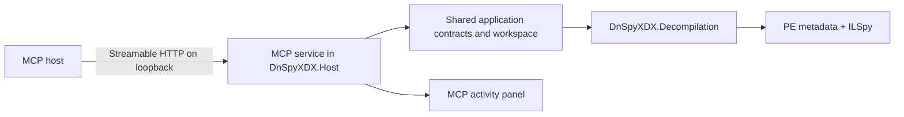

# MCP integration plan

Research reviewed on 2026-07-27 against the published MCP `2025-11-25` specification and the official C# SDK. Recheck the active protocol and SDK release before implementation because both are evolving.

## Recommendation

Add DnSpyXDX as a local, read-only MCP server. Its purpose should be to let an MCP host inspect managed assemblies through the same metadata-only backend used by the desktop application.

Host the server inside the existing DnSpyXDX application. Add a **Start MCP** control to the MCP Activity panel; off is the default. Starting it creates an authenticated Streamable HTTP endpoint bound only to loopback, and stopping it closes the endpoint and rejects new requests. Keep root policy in Settings.

Do not add a separate MCP executable or process. The embedded server should use the live `IDecompilerBackend`, so MCP and the UI see the same opened assemblies, caches, and exact symbol identities.

This shape fits MCP's host-client-server architecture: the AI host controls consent and context, while DnSpyXDX supplies one focused capability without seeing the full conversation or other servers. See the [MCP architecture specification](https://modelcontextprotocol.io/specification/2025-11-25/architecture/index) and [official C# SDK](https://github.com/modelcontextprotocol/csharp-sdk).



The UI remains the lifecycle owner. MCP startup must not delay the Photino window, and MCP shutdown must cancel active requests before disposing the shared application services.

## Intended use cases

- Identify target framework, architecture, references, resources, namespaces, and types in a managed DLL or EXE.
- Search exact types and members across opened assemblies.
- Retrieve C#, IL, or mapped IL-with-C# for a symbol.
- Follow exact metadata identities across related assemblies.
- Inspect members, signatures, metadata tokens, and semantic references without executing the assembly.
- Supply bounded source or metadata context to coding and security-analysis agents.
- Support future static callers, callees, type uses, derived-type, and interface-implementation queries after the reference index exists.

MCP should not turn DnSpyXDX into a general filesystem server, shell, debugger, or assembly editor.

## Protocol surface

Use tools for model-controlled operations and resources for application-selected or reusable context. This follows the MCP distinction between model-controlled [tools](https://modelcontextprotocol.io/specification/2025-11-25/server/tools) and application-driven [resources](https://modelcontextprotocol.io/specification/2025-11-25/server/resources).

### Initial tools

| Tool | Inputs | Result | Notes |
| --- | --- | --- | --- |
| `open_assembly` | `path` | assembly descriptor | Require an allowed root; parse metadata only |
| `close_assembly` | `moduleMvid` | closed/not found | Releases caches and file handles |
| `list_assemblies` | none | assembly descriptors | Small structured response |
| `list_children` | stable node ID, cursor | tree nodes, next cursor | Namespaces/types/resources/references; bounded pages |
| `search_symbols` | query, optional module/kind, cursor | ranked symbol summaries | Use the planned workspace index before MCP release |
| `get_symbol` | MVID + metadata token | symbol descriptor | Signature, kind, declaring type, visibility, stable resource links |
| `get_references` | MVID + metadata token | bounded reference summaries | Initially semantic outgoing links; expand after reference indexing |

Tool inputs and outputs should have explicit JSON Schemas. Return both `structuredContent` and a short text representation for compatibility, as recommended by the [tools specification](https://modelcontextprotocol.io/specification/2025-11-25/server/tools#structured-content). Do not return an entire large decompilation from a discovery tool; return a resource link.

### Resources and templates

Use a custom URI scheme so identities are stable and do not expose machine paths:

```text
dnspyxdx://assembly/{mvid}
dnspyxdx://assembly/{mvid}/symbol/{metadataToken}
dnspyxdx://assembly/{mvid}/symbol/{metadataToken}/source/{language}
dnspyxdx://assembly/{mvid}/resource/{resourceId}
```

Recommended templates:

| Template | MIME type | Content |
| --- | --- | --- |
| Assembly summary | `application/json` | identity, framework, architecture, references, diagnostics |
| Symbol descriptor | `application/json` | stable ID, signature, kind, declaring type, locations |
| Decompiled C# | `text/x-csharp` | bounded type/member document |
| IL | `text/plain` | bounded IL document |
| IL with C# | `text/plain` | mapped mixed document |
| Embedded text resource | detected text MIME | only resources already classified as safe text |

Resources can expose size, audience, priority, and modification annotations. Use size before a client fetches a large document. Emit resource-list changes when the live workspace opens or closes assemblies. Per-resource subscriptions are unnecessary while assembly contents remain read-only.

### Features to defer

- Prompts: hosts can already compose workflows from well-described tools and resources.
- Sampling: the server should provide deterministic inspection, not call an LLM itself.
- Elicitation: Settings, the activity panel, and explicit tool arguments are enough initially.
- Tasks: consider them only for project export or whole-workspace analysis that cannot finish within normal request timeouts.
- MCP Apps: the desktop UI already provides the richer interactive experience.
- Remote HTTP and OAuth: the initial Streamable HTTP endpoint is loopback-only with a local bearer token; remote/team access needs a separate OAuth design.
- Export tools: they write many files and run optional builds, requiring a separate consent and destination policy.
- Assembly editing, execution, debugging, or arbitrary command tools.

## Architecture and implementation

### Project structure

```text
src/DnSpyXDX.Host/Mcp/
  McpServerService.cs
  McpServerSettings.cs
  McpActivityLog.cs
  Tools/
  Resources/
  Serialization/
src/DnSpyXDX.UI/Components/McpActivityPanel.razor
tests/DnSpyXDX.Tests/Mcp/
```

Keep the protocol adapter in the host composition layer. Tool handlers should call application contracts rather than Razor components or ILSpy directly. Keep MCP DTOs separate from application models so the public protocol can remain compatible when internal records change.

Use `ModelContextProtocol.AspNetCore` from the [official C# SDK](https://github.com/modelcontextprotocol/csharp-sdk#packages) for Streamable HTTP and integrate its services into the existing generic host. Keep endpoint creation and disposal behind `IMcpServerService` so the activity-panel control owns a small, testable lifecycle boundary.

### Settings and endpoint lifecycle

Add these persisted settings:

- `McpEnabled`, default `false`;
- `McpPort`, default `0` for an OS-selected available port;
- a generated bearer token stored using the best available per-user protected storage, never in ordinary logs or session export.

When enabled, show the effective endpoint and connected **Start/Stop MCP** and **Copy configuration** actions in the MCP Activity panel. Bind to `127.0.0.1` and, where supported consistently, `::1`; never bind to `0.0.0.0`. A port change restarts only the MCP endpoint. App shutdown first stops accepting requests, cancels active calls, then closes the listener.

The server operates on the live workspace:

- assemblies opened through MCP appear in the assembly tree;
- assemblies opened through the UI become immediately available to MCP;
- MCP close operations update tabs/tree through the same application-state path as UI unload;
- tool handlers must marshal state notifications safely back to the Blazor UI.

Avoid duplicating workspace ownership in the MCP layer.

### Minimal MCP activity panel

Add a collapsible lower panel following the existing Search panel's layout and resizing behavior. Keep it diagnostic rather than building a full MCP management UI; a richer panel is outside this work.

The header should contain:

- **MCP Activity** and an enabled/listening/stopped/error status indicator;
- active endpoint without displaying the bearer token;
- request count and active-call count;
- **Clear** and close buttons.

Each bounded log row should show:

- timestamp;
- client name when supplied during initialization;
- operation (`tools/list`, tool name, resource read, initialize, cancellation);
- short target such as assembly name or symbol ID;
- queued/running/succeeded/cancelled/failed state;
- duration and a concise error message.

Selecting a row may reveal sanitized structured details. Do not render decompiled source, embedded-resource content, bearer tokens, full request bodies, or unrestricted filesystem paths. Retain a fixed number of entries (for example 500) in memory and discard oldest completed entries first. The panel log is session-only unless a later explicit export action is designed.

Feed the same events into `Microsoft.Extensions.Logging` with event IDs and scopes. Normal logs record lifecycle, operation, status, duration, and stable assembly/symbol IDs. Debug logging may include schema-validation diagnostics but still must not include source content, secrets, or raw messages.

### Identity and state

- Use `SymbolId(ModuleMvid, MetadataToken)` in all symbol-facing operations.
- Never accept a name alone where overloads or duplicate assemblies could be ambiguous.
- Give tree/resource nodes opaque server IDs; do not expose session GUIDs as durable identities.
- Scope cursors and client state to the current endpoint generation; invalidate them whenever the embedded server restarts.
- Treat cursors as opaque, short-lived values and use bounded pages. MCP list pagination is cursor-based and clients must not persist cursors across sessions; see [pagination](https://modelcontextprotocol.io/specification/2025-11-25/server/utilities/pagination).
- Return a structured stale/not-open error when a resource's assembly has closed.

### Cancellation, progress, and limits

Propagate each request's cancellation token through assembly opening, metadata enumeration, search, decompilation, and reference analysis. MCP receivers should stop work and release resources after cancellation; see the [cancellation specification](https://modelcontextprotocol.io/specification/2025-11-25/basic/utilities/cancellation).

Use progress notifications only for operations with measurable stages, and rate-limit updates. The [progress specification](https://modelcontextprotocol.io/specification/2025-11-25/basic/utilities/progress) requires monotonically increasing progress values and notifications tied to the request's token.

Set explicit defaults, configurable only downward by clients:

- maximum assembly file size;
- maximum simultaneously open assemblies;
- maximum search results and page size;
- maximum source characters/lines returned per resource read;
- maximum embedded-resource bytes;
- request timeout and per-session concurrency;
- aggregate model/document cache budget.

When content exceeds a limit, return metadata and a clear truncation diagnostic rather than silently cutting through a token or emitting an oversized response.

## Security model

Inspected assemblies are untrusted and may contain proprietary source reconstructed by decompilation. MCP adds an exfiltration path, so server policy must be stricter than the desktop file picker.

### Required controls

1. Use Streamable HTTP bound only to loopback because the server is enabled inside an already-running GUI. Validate every `Origin` header, require a generated bearer token, use a non-predictable endpoint path if supported, and reject requests while the activity-panel control is off. The [transport specification](https://modelcontextprotocol.io/specification/2025-11-25/basic/transports#streamable-http) explicitly requires origin validation and recommends loopback binding plus authentication for local servers.
2. Restrict file access to client-provided MCP roots or explicit allowed directories configured in Settings. Canonicalize paths, resolve links where practical, reject traversal, and revalidate after opening. The [roots specification](https://modelcontextprotocol.io/specification/2025-11-25/client/roots) requires servers to respect and validate root boundaries.
3. Do not use `Assembly.Load`, reflection, an `AssemblyLoadContext`, module initializers, or target code execution.
4. Do not expose arbitrary file-read tools. Embedded resources must be fetched by assembly/resource identity and remain size-limited.
5. Never log decompiled source, resource contents, full proprietary paths, environment variables, secrets, or MCP message bodies by default.
6. Validate all schemas, enum values, MVIDs, tokens, cursors, and URI components before backend calls.
7. Preserve existing serialization, cancellation, cache, and error boundaries; plan an out-of-process worker with memory limits for hardened deployments.
8. Describe every tool narrowly so hosts can present meaningful consent. MCP recommends visible tool exposure, invocation indicators, and human confirmation for operations; see [tool safety guidance](https://modelcontextprotocol.io/specification/2025-11-25/server/tools#user-interaction-model).

Official [MCP security guidance](https://modelcontextprotocol.io/docs/tutorials/security/security_best_practices) prefers stdio for local servers, but that requires a client-launched process and conflicts with the requested in-app toggle. The embedded loopback design therefore must apply the guidance for restricted HTTP servers: authorization, origin validation, loopback-only binding, explicit enablement, and no arbitrary process spawning. DnSpyXDX must not claim that roots, loopback, or a bearer token are a sandbox.

### If remote HTTP is added later

- Keep local and remote endpoint configuration separate.
- Never make the local activity-panel control expose a network interface.
- Require authentication and authorization; sessions and the local bearer token are not sufficient for remote access.
- Use established OAuth libraries, HTTPS, audience validation, least-privilege scopes, and redacted logs.
- Keep remote workspaces isolated per authenticated principal.

These are protocol requirements and recommendations in the [Streamable HTTP transport](https://modelcontextprotocol.io/specification/2025-11-25/basic/transports#streamable-http) and [security best practices](https://modelcontextprotocol.io/docs/tutorials/security/security_best_practices).

## Delivery plan

### Phase 0 — compatibility spike

**Status: Functionally demonstrated; exit verification incomplete.** The endpoint, Settings control, initial tools, authentication, origin checks, and activity panel exist. MCP Inspector, two-host verification, full lifecycle/security automation, and Windows verification remain.

- [x] Pin a stable official C# SDK version centrally.
- [x] Build the activity-panel-controlled loopback endpoint with `list_assemblies` and `open_assembly`.
- [ ] **Partial:** Add the minimal activity panel and structured activity/log pipeline. The panel logs implemented handlers; interception, queued/running entries, client identity, and structured logging remain.
- [ ] Verify protocol initialization/capability negotiation with MCP Inspector and at least two real hosts.
- [ ] **Partial:** Confirm authentication, origin rejection, capability negotiation, and sanitized logging in normal, debug, cancellation, and failure paths. Happy-path manual HTTP coverage exists; the full matrix does not.
- [ ] Record the supported MCP protocol version and SDK compatibility policy.

Exit: switching MCP on starts a protected loopback endpoint, a host can connect and open a fixture under an allowed root, the panel shows sanitized request state, switching MCP off cancels requests and closes the endpoint, and the lifecycle works on Windows and Linux.

### Phase 1 — read-only inspection MVP

**Status: In progress.** Initial assembly/symbol tools and source resources exist. Configured roots are absolute, snapshot-based, link-resolved, and revalidated after open; roots-capable clients are intersected with configured roots; assembly size/open-count/open-timeout/concurrent-open limits and stable coded errors are present. Complete resources, `list_children`, pagination, endpoint-wide limits, and integration/security tests remain.

- [ ] **Partial:** Implement all initial tools and resource templates. `list_children`, assembly/symbol descriptors, and embedded-text resources remain.
- [ ] **Partial:** Add roots enforcement, limits, cursor pagination, structured errors, cancellation, and safe logging. Configured/client root enforcement, initial open limits, and stable coded errors are implemented; full limits, pagination, cursor errors, and wire-level error tests remain.
- [x] Return resource links from search/symbol tools and fetch decompilation only on demand.
- [x] Reuse exact cross-assembly MVID/token resolution.
- [x] Generate example host configuration from the live endpoint settings.

Exit: an agent can open related assemblies, find an overloaded member, retrieve its declaring type's C# or IL, follow an exact external reference, and cannot read outside allowed roots.

### Phase 2 — analysis

**Status: Not started as a phase.** A bounded outgoing `Uses` operation exists as an early functional slice; the shared index and richer relations remain.

- [ ] Build the planned assembly-open search/reference index once and share it with desktop and MCP paths.
- [ ] Add callers, callees, type uses, derived types, and interface implementations.
- [ ] **Partial:** Return bounded graph edges plus resource links instead of large nested documents. Outgoing `Uses` results are bounded and linked.
- [ ] Add deterministic API/assembly comparison resources if product demand justifies them.

### Phase 3 — richer integration

**Status: Not started.** Resource-list notifications, client visibility/revocation, and confirmation policies remain.

- [ ] Emit resource-list changes as the live workspace changes.
- [ ] Add per-client connection visibility and revocation.
- [ ] Add optional confirmation policies per tool if write-capable operations are ever proposed.
- [ ] Extend the activity view only after the separate richer-panel work establishes its UI contract.

## Test matrix

- Protocol initialization, version negotiation, capabilities, clean shutdown, and malformed JSON-RPC.
- Tool/resource schema conformance and stable structured results.
- Windows and Linux loopback binding, endpoint restart, authentication, origin validation, and port conflicts.
- Settings persistence, default-off behavior, activity-panel bounds, sanitization, and logging redaction.
- Cancellation before/during open, search, decompile, and resource reads.
- Root traversal, symlinks, case differences, UNC paths, inaccessible paths, and roots changing mid-request.
- Invalid/native/truncated PE files, pathological metadata, missing dependencies, duplicate names, and mismatched versions.
- Exact cross-assembly MVID/token navigation and same-folder dependency discovery.
- Pagination stability, invalid/stale cursors, limits, truncation diagnostics, and cache eviction.
- Host disconnect, broken pipe, repeated initialization, and process cleanup.
- Golden responses for representative assembly, symbol, search, and source resources.
- MCP Inspector plus integration tests against supported production hosts.

## Decisions to make before implementation

1. Whether `open_assembly` requires MCP roots exclusively or also permits allowed directories configured in Settings. Recommendation: support both, intersect them when both exist, and deny unrestricted paths.
2. Whether NuGet package-cache and runtime directories may be searched for dependencies. Recommendation: same directory and allowed roots only for the MVP.
3. Default response and assembly size limits. Measure representative Unity, desktop, and obfuscated assemblies before selecting values.
4. Whether source resources return a complete bounded document or support line-range templates. Recommendation: add line ranges once real host behavior shows that whole type documents exceed practical context limits.
5. Whether project export belongs in MCP. Recommendation: defer until a separate write-capability consent model and destination-root policy are designed.

## Success criteria

- Useful assembly analysis through an explicitly enabled desktop instance.
- No target assembly code execution.
- Exact identities instead of name-based guesses.
- Bounded, cancellable, structured responses suitable for LLM context windows.
- No filesystem access outside explicit roots.
- No non-loopback listener or write capability by default.
- The MCP adapter remains thin; decompilation, search, navigation, and future analysis logic stay reusable by both UI and server.
